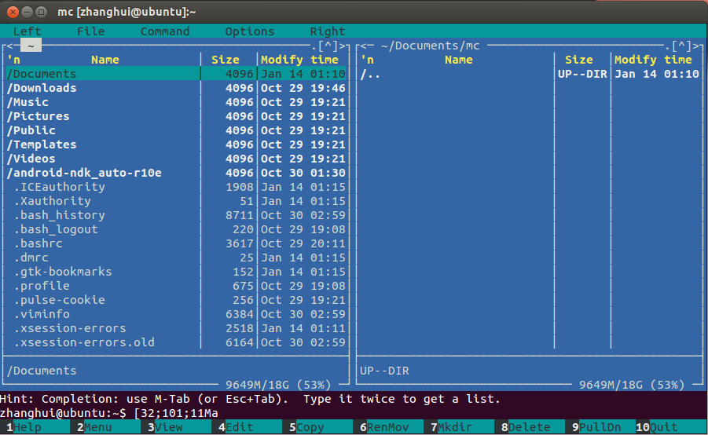

# Miguel_De_Icaza

Miguel de Icaza,墨西哥籍美国人,最为出名的是发起了GNOME, Mono, 和 Xamarin等项目。

## 生平:
__早年:__ 
De Icaza,1972年9月23日出生在墨西哥城(Mexico City),大学就读于National Autonomous University of Mexico(NAUM),这所学校在全世界综合排名在80左右[1]，有趣的是，他并没有拿到学位证,中途辍学了.这个是由他自己在Ximian成立十周年的时候发布的一篇博客中提到的[2].他自己的父母也格外的腻害,父亲是物理学家，母亲是生物学家.1992年,他开始投入开源软件的事业中.

__早期软件事业:__
他为Linux写的最早的一个软件是 Midnight Commander File Manager,这是Linux上的一个可视文件管理系统.
Ubuntu上的安装命令是: sudo apt-get install mc
启动命令:mc
界面截图如下:

对Linux下的文件管理操作还是很方便的.

同时,他也是Wine Project最早的参与者之一.Wine Project

## 作品
1. GNU Midnight Commander

## 参考资料
[1]: 世界学府排名: https://www.topuniversities.com/node/4194/ranking-details/university-subject-rankings/university-rankings
[2]: https://tirania.org/blog/archive/2009/Oct-19.html